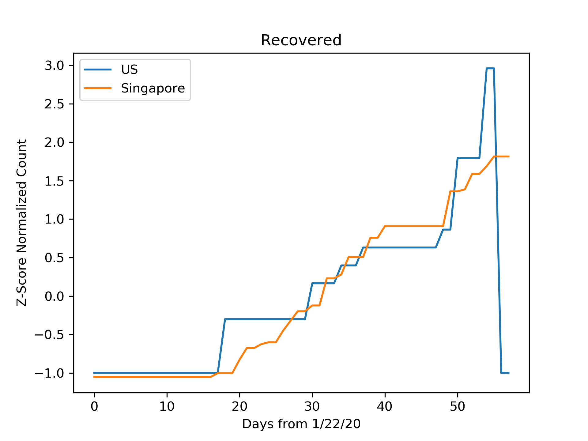

# COVID19
The idea is to do normalized analysis on case data for COVID19 obtained from https://github.com/CSSEGISandData/COVID-19,  to infer hidden trends in data that are not apparent from the absolute values of data.
  
<b>Confirmed Cases:</b> 
https://github.com/parampopat/COVID19/blob/master/analysis_confirmed.csv
  

<b>Recovered Cases:</b> 
https://github.com/parampopat/COVID19/blob/master/analysis_recovered.csv
  

<b>Death Cases:</b> 
https://github.com/parampopat/COVID19/blob/master/analysis_deaths.csv
  

<b>Author:</b> 
Param Popat (https://www.linkedin.com/in/parampopat/)
  

