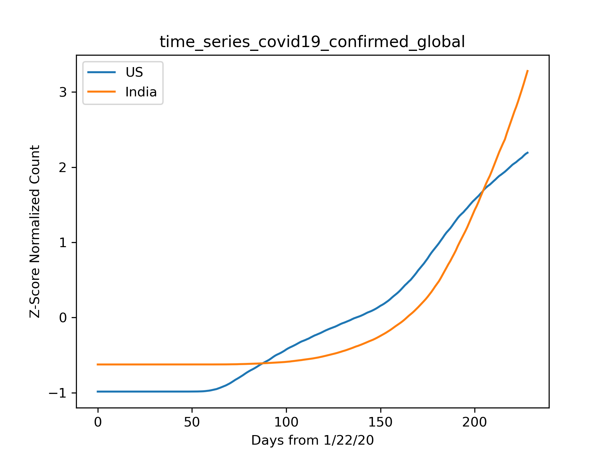
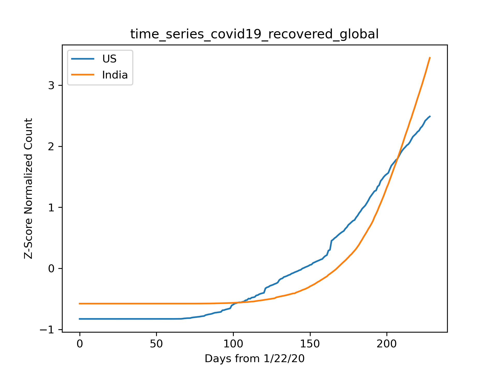

# COVID19
The idea is to do normalized analysis on case data for COVID19 obtained from <a href="https://github.com/CSSEGISandData/COVID-19">https://github.com/CSSEGISandData/COVID-19</a>,  to infer hidden trends in data that are not apparent from the absolute values of data.
  
<b>Confirmed Cases:</b> 
<a href="https://github.com/parampopat/COVID19/blob/master/analysis_confirmed.csv">https://github.com/parampopat/COVID19/blob/master/analysis_time_series_covid19_confirmed_global.csv</a>
  

<b>Recovered Cases:</b> 
<a href="https://github.com/parampopat/COVID19/blob/master/analysis_recovered.csv">https://github.com/parampopat/COVID19/blob/master/analysis_time_series_covid19_recovered_global.csv</a>
  

<b>Death Cases:</b> 
<a href="https://github.com/parampopat/COVID19/blob/master/analysis_deaths.csv">https://github.com/parampopat/COVID19/blob/master/analysis_time_series_covid19_deaths_global.csv</a>
  

<b>Author:</b> 
Param Popat (<a href="https://www.linkedin.com/in/parampopat/">LinkedIn</a>)
  
<b>Source:</b> 
<a href="https://github.com/parampopat/COVID19">GitHub</a>
  

